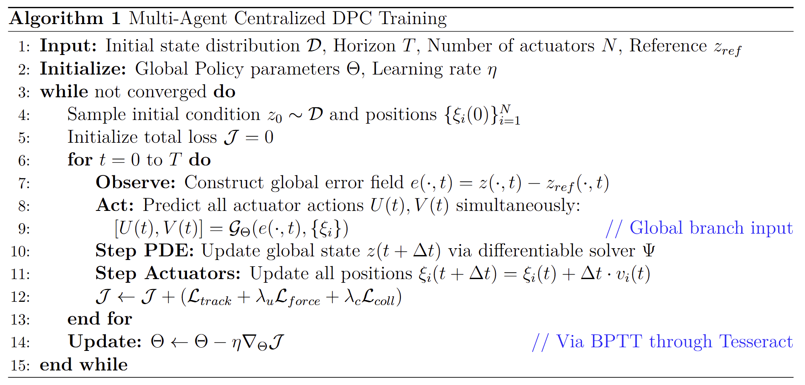
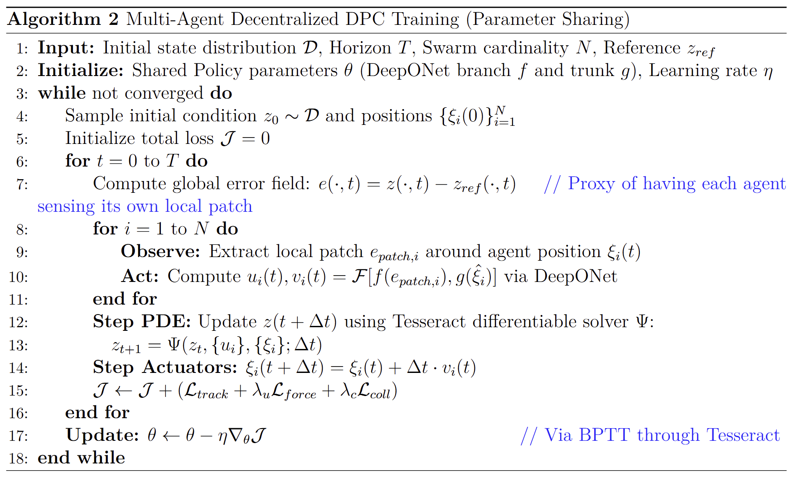
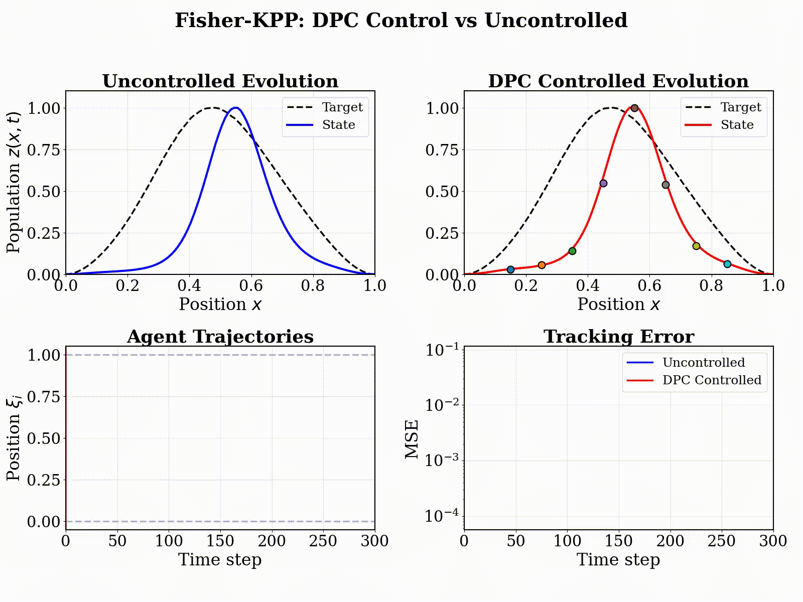

# Multi-Agent Differentiable Predictive Control for Zero-Shot PDE Scalability
> "You speak for the whole planet, do you? For the common consciousness of every dewdrop, of every pebble, of even the liquid central core of the planet?"
> 
> "I do, and so can any portion of the planet in which the intensity of the common consciousness is great enough."
>
> — **Isaac Asimov**, *Foundation and Earth*


This project introduces and experiments with a decentralized control framework for systems described by PDEs. Leveraging [Tesseract-Jax](https://github.com/pasteurlabs/tesseract-jax) to implement the PDE solver as a differentiable layer, we leverage the [Differentiable Predictive Control](https://arxiv.org/abs/2011.03699) framework to enable autonomous agents to interact with the physical field for trajectory tracking.

This project was ideated and evaluated by [Pietro Zanotta](https://github.com/PietroZanotta)<sup>1</sup>, [Dibakar Roy](https://github.com/RoyDibs)<sup>1</sup> and [Honghui Zheng](https://github.com/Honghui-Zheng)<sup>1</sup> as part of the [Tesseract Hackathon 2025](https://pasteurlabs.ai/tesseract-hackathon-2025/). 

Contacts:
- Pietro Zanotta: pzanott1@jhu.edu
- Dibakar Roy: droysar1@jh.edu
- Honghui Zheng: hzheng39@jh.edu

<sup>1</sup>: shared first authorship


---

## Key Features
- **Differentiable Operator Learning for Control**: we recast policy synthesis for PDE systems as an operator learning problem using the DeepONet framework. By treating the PDE solver as a differentiable layer through the Tesseract differentiable programming library, we compute exact sensitivity gradients for policy optimization then used within the *Differentiable Predictive Control* framewok.
- **Zero-Shot Scalability**: Policies trained on a fixed swarm size $N$ generalize to unseen cardinalities $M$ (e.g., training on 20 agents and deploying on 60) without further tuning, allowing resilience to actuator failure.
- **Communication-Free Coordination:** We test the scenarion where agents operate using local-only sensing and zero inter-agent communication, where we observe an *emerging self-normalization property*, coming from stigmergic interaction, preventing overactuation. 
- **Theoretical Gradient Consistency**: We provide a mathematical foundation theorem ensuring that discrete policy gradients converge to the mean-field limit as the swarm size $N \rightarrow \infty$.
- **Parameter Efficiency:** In our toy examples, the decentralized approach utilizes *48% fewer parameters* in the 1d cases and *76% fewer* in the 2d case than centralized benchmarks while maintaining competitive performance.

For a more rigorous discussion about all the above points we suggest reading through our [technical document](Multi_agent_report_2026.pdf).

---

## Table of Contents
- [Multi-Agent Differentiable Predictive Control for Zero-Shot PDE Scalability](#multi-agent-differentiable-predictive-control-for-zero-shot-pde-scalability)
  - [Key Features](#key-features)
  - [Table of Contents](#table-of-contents)
  - [About this Project](#about-this-project)
    - [Problem Statement](#problem-statement)
    - [Differentiable Predictive Control](#differentiable-predictive-control)
    - [Key advantages:](#key-advantages)
  - [Numerical Experiments](#numerical-experiments)
    - [Performance Summary](#performance-summary)
  - [Structure of this Repository](#structure-of-this-repository)
  - [Getting Started](#getting-started)
  - [Future Work](#future-work)
  - [Tech Stack](#tech-stack)

---

## About this Project
This research explores the intersection of Differentiable Programming, Operator Learning, and Swarm Intelligence. We demonstrate that treating a PDE solver as a neural network layer allows for the training of highly efficient, decentralized control policies. In this section we provide a brief introduction to the problem formulation. For a more rigorous discussion we refer to out [technical document](Multi_agent_report_2026.pdf).

### Problem Statement

The control objective is to find an optimal control sequence $U(t) = \lbrace u_i(t) \rbrace_{i=1}^N$ and velocity sequence $V(t) = \lbrace v_i(t) \rbrace_{i=1}^N$ that minimizes a cost functional $\mathcal{J}$ involving a tracking cost $\mathcal{L}\_{track}(z, z_{ref})$, a term $\mathcal{L}\_{force}(u)$ discouraging large energy consumption, and $\mathcal{L}\_{coll}(\xi)$ to prevent collision between the actuators:

$$\min_{U,V} \mathcal{J} = \mathbb{E}_{z_0 \sim \mathcal{D}} \left[ \int_{0}^{T} \left( \mathcal{L}_{track}(z, z_{ref}) + \lambda_u \mathcal{L}_{force}(u) + \lambda_c \mathcal{L}_{coll}(\xi) \right) dt \right]$$

where $\xi$ is the position of the $i$-th actuator.

**System Dynamics (PDE):** The state field $z(x,t)$ evolves according to a non-homogeneous nonlinear partial differential equation:

$$\frac{\partial z(x,t)}{\partial t} = \mathcal{A}(z; \mu) + \mathcal{B}(x,t)$$

where the total forcing $\mathcal{B}(x,t)$ is the superposition of individual actuator contributions filtered through a spatial Gaussian kernel $b(x, \xi_i)$:

$$\mathcal{B}(x,t) = \sum_{i=1}^{N} b(x, \xi_i(t)) u_i(t)$$

**Actuator Kinematics:** Each mobile actuator $i \in \{1, \dots, N\}$ follows first-order integrator dynamics:

$$\frac{d\xi_i(t)}{dt} = v_i(t), \quad \xi_i(0) = \xi_{i,0}$$

**Constraints:**
- Control Saturation: $|u_i(t)| \le u_{\max}$
- Kinematic Limits: $|v_i(t)| \le v_{\max}$
- Boundary Containment: $\xi_i(t) \in \Omega$

### Differentiable Predictive Control


To syntesize a policy approximating the optimal control sequence $U(t) = \lbrace u_i(t) \rbrace_{i=1}^N$ and velocity sequence $V(t) = \lbrace v_i(t) \rbrace_{i=1}^N$ we rely on DIfferentiable Predictive Control. In our framework, the control policy is parameterized by a neural operator $\mathcal{G}_{\theta}$ that maps current observations to optimal actions. During training, we perform the following steps:
- **Forward Pass**: The current state $z_k$ and control actions $u_k$ are passed through a differentiable operator $\Psi$ (the PDE solver) to predict the future state $z_{k+1}$. It is relevant that such a solver is created using Tesseract, to allow differentiable simulations.
- **Sensitivity Analysis**: By applying the chain rule through the solver, we compute exact sensitivity gradients of the future state with respect to the policy parameters $\theta$
- **Policy Optimization**: These gradients are used to update the neural network, minimizing the total loss $\mathcal{J}$ over a trajectory of length $K$.

### Key advantages:
- **Real-Time Efficiency**: Once trained, the policy is a simple feed-forward neural network, enabling near-instantaneous control decisions during deployment
- **Exact Gradients**: By using Tesseract, we avoid the approximations found in reinforcement learning, instead utilizing the underlying physics to guide optimization
- **Zero-Shot Scalability**: Because the policy maps the error field to actions at any spatial query point $\xi \in \Omega$, it can be deployed on arbitrary agent configurations and swarm sizes, making our policy resilient to the case of actuator failure
- **Communication-Free Scaling**: In the decentralized scenario, because each agent shares the same parameters and "senses" the global state through the physical field, the swarm naturally coordinates its actions (stigmergy) without needing inter-agent communication

Note that part of the theoretical results on Zero-Shot Scalability rely on a conjecture that we are only empirically validating. For a more rigorous discussion about all the above points we suggest reading through our [technical document](Multi_agent_report_2026.pdf).

Algorithm pseudocodes can be found below:
- **Centralized Policy Pseudocode:**



- **Centralized Policy Pseudocode:**



---

## Numerical Experiments

The framework was validated on two primary physical systems:
1.  **Linear Heat Equation:** Focused on temperature tracking and heat spreading.
2.  **Nonlinear Fisher-KPP Equation:** Modeled population dynamics and chemical fronts, where agents must overcome natural growth to achieve stability.

### Performance Summary

| Metric | Heat 1d (Centr.) | Heat 1d (Decentr.) | Heat 2d (Centr.) | Heat 2d (Decentr.) | Fisher-KPP (Centr.) | Fisher-KPP (Decentr.) |
| :--- | :---: | :---: | :---: | :---: | :---: | :---: |
| **Branch Input Dim** | 200 | 40 | 1024 | 144 | 200 | 40 |
| **Total Parameters** | 21,794 | 11,298 | 2,116,003 | 158,531 | 21,794 | 11,298 |
| **Final Tracking Loss** | 5.2e-3 | 6.4e-3 | 7.8e-3 | 9.0e-3 | 7.0e-3 | 8.3e-3 |
| **Scalability** | Zero-shot | Zero-shot | Zero-shot | Zero-shot | Zero-shot | Zero-shot |
| **Communication** | Global | None | Global | None | Global | None |
| **Training Time (500 ep.)** | ~1 min | ~1 min | ~4 min | ~3 min | ~3 min | ~3 min |

---

## Structure of this Repository
```text
tesseract-hackathon/
├── examples/                       # High-level scripts for specific PDE problems
│   ├── fkpp1d/                     # Fisher-KPP 1D reaction-diffusion examples
│   │   ├── centralized/            # Training and visualization for global control
│   │   └── decentralized/          # Multi-agent/local control versions
│   ├── heat1d/                     # 1D Heat Equation examples
│   │   ├── centralized/            
│   │   └── decentralized/          
│   └── heat2D/                     # 2D Heat Equation examples   
│       ├── centralized/
│       └── decentralized/
│
├── models/                         # Core neural network architectures
│   └── policy.py                   # JAX implementation of the DPC policies
│
├── tesseracts/                     # The "Legacy" Simulator Wrappers
│   ├── solverFKPP_.../             # Solvers specifically for FKPP problems
│   ├── solverHeat_.../             # Solvers specifically for Heat problems (both 1d and 2d)
│   │   ├── solver.py               # The underlying physics engine logic
│   │   ├── tesseract_api.py        # Interface defining 'apply' and 'vjp' for JAX
│   │   └── tesseract_config.yaml
│   └── ...
│
├── requirements.txt                # Python dependencies
└── README.md                       # Project documentation
```

---

## Getting Started

0. Clone this repo:
```bash
git clone https://github.com/PietroZanotta/Multi-Agent-DPC
cd Multi-Agent-DPC
```

1. Create your virtual environment: 
```bash
python -m venv .venv
```
and activate it:
- Linux/MacOS:
```bash
source .venv/bin/activate
```
- Windows:
```powershell
.venv/Scripts/activate
```
2. Install requirements:
```bash
pip install -r requirements.txt
```
If you have access to a GPU and are planning to train the policies on your device we suggest you also download `jax[cuda]`.

3. Build the Tesseracts of interests (in this demo only the Heat equation Tesseracts. The process is similar for the other Tesseracts):
```bash
# Build the centralized policy Tesseract
cd tesseracts/solverHeat_centralized && Tesseract build .

# Build the decentralized policy Tesseract
cd ../solverHeat_decentralized && Tesseract build .
```

> [!NOTE]
> **For Mac Users:** If `Tesseract build .` doesn't work because your system already has Tesseract OCR installed (which conflicts with the Tesseract-JAX command), you can use the full path to the tesseract binary inside your virtual environment instead (or use aliasing):
> ```bash
> cd tesseracts/solverHeat_centralized && /path/to/your/venv/bin/tesseract build .
> ```
> For example, if your virtual environment is named `.venv`, the command would be:
> ```bash
> cd tesseracts/solverHeat_centralized && ./.venv/bin/tesseract build .
> ```

4. Once the differentiable physical solver has been created, we test the pretrained policies as:
```bash
# Test the centralize policy
cd ../../examples/heat1d/centralized && python visualize_conference.py

# Test the decentralized policy
cd ../decentralized && python visualize_conference.py
```
The result for the **centralized policy** is:


while the **decentralized policy** result for  the same problem is:


We invite you to explore further our examples. In particular we highlight the `animate.py` scripts which are creating GIFs and MP4 documents (this might require you to install [FFMpegWriter](https://ffmpeg.org/)). `animate.py` produces results like the following for the Fisher-KPP equation:

- **Centralized policy**:
  
  
  
- **Decentralized policy**: 
  
  

Similar visualizations for the 2D Heat equation:

- **Centralized policy**: 
  
  
  
- **Decentralized policy**: 
  
  

Last we highligh that the script supporting the empirical evidence underlying our self-normalization conjecture are produced running `/examples/fkpp1d/decentralized/visualize_lambda_effort.py` and `/examples/fkpp1d/decentralized/visualize_comparison.py`.

[NOTE!] The workflow to reproduce the results is the following: 
1. Build the tesseract of interest (you find then in the `tesseracts` folder) with `tesseract build PATH/TO/TESSERACT` (e.g. for decentralize FKPP do `cd tesseracts/solverFKPP_decentralized && tesseract build .`)
2. Train the policy in `examples/PDE_OF_INTEREST` (e.g. for decentralize FKPP do `cd ../../examples/fkpp1d/decentralized && python train.py`). NOTE that pretrained models are already provided for anybody who does not have access to a GPU.
3. Produce the visualizations of you interest (e.g. for decentralize FKPP do `python visualize_conference.py && python animate.py`) 

---

## Future Work
There are various research directions we believe can stem from this project. Here is a list of the ones we believe are the most promising:
- Understand all the perks and the limitations of casting the policy synthesis into an operator learning paradigm. 
- Estending our theoretical analysis to a wider class of PDEs and formally proving our serf-normalization conjecture.
- Implementing Shared Memory strategies (e.g. `/dev/shm`) to minimize the serialization cost of communication beween the python script and the Tesseract during the training of the policy.

---

## Tech Stack

- **Processor:** Intel Core Ultra 9 275HX (24 cores, up to 5.4 GHz)
- **GPU:** NVIDIA GeForce RTX 5090 Laptop GPU (24GB GDDR7 VRAM)
- **Operating System:** Ubuntu 22.04 running under Windows Subsystem for Linux (WSL2)
- **Main Frameworks:** JAX (v0.8.1) for numerical computing; Tesseract-JAX (v0.2.2) for differentiable PDE solvers
- **Hardware Acceleration:** CUDA backend with NVIDIA driver v581.57

See our [technical document](Multi_agent_report_2026.pdf) for details about our experimental setup.

---
