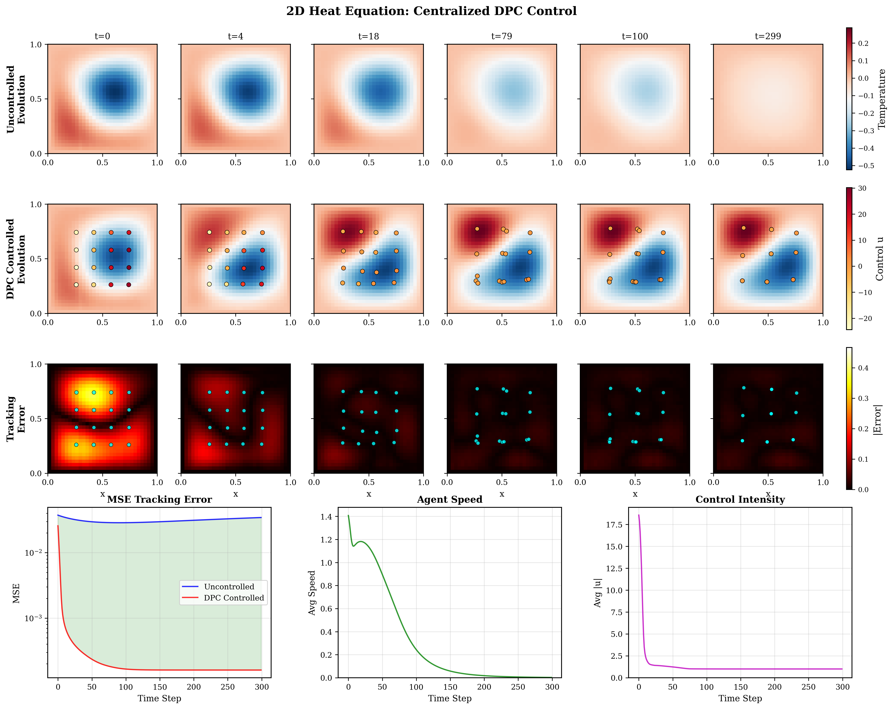

# Multi-Agent Differentiable Predictive Control for Zero-Shot PDE Scalability
> "You speak for the whole planet, do you? For the common consciousness of every dewdrop, of every pebble, of even the liquid central core of the planet?"
> 
> "I do, and so can any portion of the planet in which the intensity of the common consciousness is great enough."
>
> — **Isaac Asimov**, *Foundation and Earth*


This project introduces and experiments with a decentralized control framework for systems described by PDEs. Leveraging [Tesseract-Jax](https://github.com/pasteurlabs/tesseract-jax) to implement the PDE solver as a differentiable layer, we leverage the [Differentiable Predictive Control](https://arxiv.org/abs/2011.03699) framework to enable autonomous agents to interact with the physical field for trajectory tracking.

This project was ideated and evaluated by [Pietro Zanotta](https://github.com/PietroZanotta)<sup>1</sup>, [Dibakar Roy](https://github.com/RoyDibs)<sup>1</sup> and [Honghui Zheng](https://github.com/Honghui-Zheng)<sup>1</sup> as part of the [Tesseract Hackathon 2025](https://pasteurlabs.ai/tesseract-hackathon-2025/). 

Contacts:
- Pietro Zanotta: pzanott1@jhu.edu
- Dibakar Roy: droysar1@jh.edu
- Honghui Zheng: hzheng39@jh.edu

<sup>1</sup>: shared first authorship


---

## Key Features
- **Differentiable Operator Learning for Control**: we recast policy synthesis for PDE systems as an operator learning problem using the DeepONet framework. By treating the PDE solver as a differentiable layer through the Tesseract differentiable programming library, we compute exact sensitivity gradients for policy optimization then used within the *Differentiable Predictive Control* framewok.
- **Zero-Shot Scalability**: Policies trained on a fixed swarm size $N$ generalize to unseen cardinalities $M$ (e.g., training on 20 agents and deploying on 60) without further tuning, allowing resilience to actuator failure.
- **Communication-Free Coordination:** We test the scenarion where agents operate using local-only sensing and zero inter-agent communication, where we observe an *emerging self-normalization property*, coming from stigmergic interaction, preventing overactuation. 
- **Theoretical Gradient Consistency**: We provide a mathematical foundation theorem ensuring that discrete policy gradients converge to the mean-field limit as the swarm size $N \rightarrow \infty$.
- **Parameter Efficiency:** In our toy examples, the decentralized approach utilizes *48% fewer parameters* in the 1d cases and *76% fewer* in the 2d case than centralized benchmarks while maintaining competitive performance.

For a more rigorous discussion about all the above points we suggest reading through our [technical document](Multi_agent_report_2026.pdf).

---

## Table of Contents
- [Multi-Agent Differentiable Predictive Control for Zero-Shot PDE Scalability](#multi-agent-differentiable-predictive-control-for-zero-shot-pde-scalability)
  - [Key Features](#key-features)
  - [Table of Contents](#table-of-contents)
  - [About this Project](#about-this-project)
    - [Problem Statement](#problem-statement)
    - [Differentiable Predictive Control](#differentiable-predictive-control)
  - [Numerical Experiments](#numerical-experiments)
    - [Performance Summary](#performance-summary)
  - [Structure of this Repository](#structure-of-this-repository)
  - [Getting Started](#getting-started)
    - [Prerequisites](#prerequisites)
    - [Building Tesseract Solvers](#building-tesseract-solvers)
    - [Quick Start: Visualizing Pre-trained Models](#quick-start-visualizing-pre-trained-models)
      - [**Heat Equation - 1D**](#heat-equation---1d)
      - [**Fisher-KPP Equation - 1D**](#fisher-kpp-equation---1d)
      - [**Heat Equation - 2D**](#heat-equation---2d)
    - [Optional: Generate Animations](#optional-generate-animations)
    - [Optional: Train Custom Policies](#optional-train-custom-policies)
    - [Advanced: Analyzing Scalability \& Stigmergy](#advanced-analyzing-scalability--stigmergy)
    - [Troubleshooting](#troubleshooting)
  - [Future Work](#future-work)
  - [Tech Stack](#tech-stack)

---

## About this Project
This research explores the intersection of Differentiable Programming, Operator Learning, and Swarm Intelligence. We demonstrate that treating a PDE solver as a neural network layer allows for the training of highly efficient, decentralized control policies. In this section we provide a brief introduction to the problem formulation. For a more rigorous discussion we refer to out [technical document](Multi_agent_report_2026.pdf).

### Problem Statement

The control objective is to find an optimal control sequence $U(t) = \lbrace u_i(t) \rbrace_{i=1}^N$ and velocity sequence $V(t) = \lbrace v_i(t) \rbrace_{i=1}^N$ that minimizes a cost functional $\mathcal{J}$ involving a tracking cost $\mathcal{L}\_{track}(z, z_{ref})$, a term $\mathcal{L}\_{force}(u)$ discouraging large energy consumption, and $\mathcal{L}\_{coll}(\xi)$ to prevent collision between the actuators:

$$\min_{U,V} \mathcal{J} = \mathbb{E}_{z_0 \sim \mathcal{D}} \left[ \int_{0}^{T} \left( \mathcal{L}_{track}(z, z_{ref}) + \lambda_u \mathcal{L}_{force}(u) + \lambda_c \mathcal{L}_{coll}(\xi) \right) dt \right]$$

where $\xi$ is the position of the $i$-th actuator.

**System Dynamics (PDE):** The state field $z(x,t)$ evolves according to a non-homogeneous nonlinear partial differential equation:

$$\frac{\partial z(x,t)}{\partial t} = \mathcal{A}(z; \mu) + \mathcal{B}(x,t)$$

where the total forcing $\mathcal{B}(x,t)$ is the superposition of individual actuator contributions filtered through a spatial Gaussian kernel $b(x, \xi_i)$:

$$\mathcal{B}(x,t) = \sum_{i=1}^{N} b(x, \xi_i(t)) u_i(t)$$

**Actuator Kinematics:** Each mobile actuator $i \in \{1, \dots, N\}$ follows first-order integrator dynamics:

$$\frac{d\xi_i(t)}{dt} = v_i(t), \quad \xi_i(0) = \xi_{i,0}$$

**Constraints:**
- Control Saturation: $|u_i(t)| \le u_{\max}$
- Kinematic Limits: $|v_i(t)| \le v_{\max}$
- Boundary Containment: $\xi_i(t) \in \Omega$

### Differentiable Predictive Control


To syntesize a policy approximating the optimal control sequence $U(t) = \lbrace u_i(t) \rbrace_{i=1}^N$ and velocity sequence $V(t) = \lbrace v_i(t) \rbrace_{i=1}^N$ we rely on DIfferentiable Predictive Control. In our framework, the control policy is parameterized by a neural operator $\mathcal{G}_{\theta}$ that maps current observations to optimal actions. During training, we perform the following steps:
- **Forward Pass**: The current state $z_k$ and control actions $u_k$ are passed through a differentiable operator $\Psi$ (the PDE solver) to predict the future state $z_{k+1}$. It is relevant that such a solver is created using Tesseract, to allow differentiable simulations.
- **Sensitivity Analysis**: By applying the chain rule through the solver, we compute exact sensitivity gradients of the future state with respect to the policy parameters $\theta$
- **Policy Optimization**: These gradients are used to update the neural network, minimizing the total loss $\mathcal{J}$ over a trajectory of length $K$.

Note that part of the theoretical results on Zero-Shot Scalability rely on a conjecture that we are only empirically validating. For a more rigorous discussion about all the above points we suggest reading through our [technical document](Multi_agent_report_2026.pdf).

Algorithm pseudocodes can be found below:
- **Centralized Policy Pseudocode:**


- **Decentralized Policy Pseudocode:**


---

## Numerical Experiments

The framework was validated on two primary physical systems:
1.  **Linear Heat Equation:** Focused on temperature tracking and heat spreading.
2.  **Nonlinear Fisher-KPP Equation:** Modeled population dynamics and chemical fronts, where agents must overcome natural growth to achieve stability.

### Performance Summary

| Metric | Heat 1d (Centr.) | Heat 1d (Decentr.) | Heat 2d (Centr.) | Heat 2d (Decentr.) | Fisher-KPP (Centr.) | Fisher-KPP (Decentr.) |
| :--- | :---: | :---: | :---: | :---: | :---: | :---: |
| **Branch Input Dim** | 200 | 40 | 1024 | 144 | 200 | 40 |
| **Total Parameters** | 21,794 | 11,298 | 2,116,003 | 158,531 | 21,794 | 11,298 |
| **Final Tracking Loss** | 5.2e-3 | 6.4e-3 | 7.8e-3 | 9.0e-3 | 7.0e-3 | 8.3e-3 |
| **Scalability** | Zero-shot | Zero-shot | Zero-shot | Zero-shot | Zero-shot | Zero-shot |
| **Communication** | Global | None | Global | None | Global | None |
| **Training Time (500 ep.)** | ~1 min | ~1 min | ~4 min | ~3 min | ~3 min | ~3 min |

---

## Structure of this Repository
```text
tesseract-hackathon/
├── examples/                       # High-level scripts for specific PDE problems
│   ├── fkpp1d/                     # Fisher-KPP 1D reaction-diffusion examples
│   │   ├── centralized/            # Training and visualization for global control
│   │   └── decentralized/          # Multi-agent/local control versions
│   ├── heat1d/                     # 1D Heat Equation examples
│   │   ├── centralized/            
│   │   └── decentralized/          
│   └── heat2D/                     # 2D Heat Equation examples   
│       ├── centralized/
│       └── decentralized/
│
├── models/                         # Core neural network architectures
│   └── policy.py                   # JAX implementation of the DPC policies
│
├── tesseracts/                     # The "Legacy" Simulator Wrappers
│   ├── solverFKPP_.../             # Solvers specifically for FKPP problems
│   ├── solverHeat_.../             # Solvers specifically for Heat problems (both 1d and 2d)
│   │   ├── solver.py               # The underlying physics engine logic
│   │   ├── tesseract_api.py        # Interface defining 'apply' and 'vjp' for JAX
│   │   └── tesseract_config.yaml
│   └── ...
│
├── requirements.txt                # Python dependencies
└── README.md                       # Project documentation
```

---

## Getting Started

### Prerequisites

0. **Clone the repository:**
```bash
git clone https://github.com/PietroZanotta/Multi-Agent-DPC
cd Multi-Agent-DPC
```

1. **Set up Python virtual environment:**
```bash
python -m venv .venv
```

Activate the virtual environment:
- **Linux/MacOS:**
```bash
source .venv/bin/activate
```
- **Windows (PowerShell):**
```powershell
.venv\Scripts\activate
```

2. **Install dependencies:**
```bash
pip install -r requirements.txt
```

> [!TIP]
> If you have GPU access and want to accelerate training, also install JAX with CUDA:
> ```bash
> pip install jax[cuda12]
> ```

3. **Verify Tesseract installation:**
```bash
which tesseract  # Linux/MacOS
# or
where tesseract  # Windows
```

> [!NOTE]
> **For Mac Users:** If `tesseract build` conflicts with the Tesseract OCR binary, use the full path:
> ```bash
> /path/to/venv/bin/tesseract build .
> ```

---

### Building Tesseract Solvers

Build the differentiable PDE solvers (required only once). This step containerizes each solver with its neural network policy as a differentiable layer.

```bash
# Build Heat Equation (1D)
cd tesseracts/solverHeat_centralized && tesseract build .
cd ../solverHeat_decentralized && tesseract build .

# Build Fisher-KPP (1D reaction-diffusion)
cd ../solverFKPP_centralized && tesseract build .
cd ../solverFKPP_decentralized && tesseract build .

# Build 2D Heat Equation (2D)
cd ../solverHeat2D_centralized && tesseract build .
cd ../solverHeat2D_decentralized && tesseract build .

# Return to project root
cd ../..
```

> [!INFO]
> Each `tesseract build` command creates a Docker image containing the PDE solver and its trained policy. The first build takes 5-10 minutes per solver; subsequent builds are cached. You can verify built images with:
> ```bash
> docker images | grep solver
> ```

---

### Quick Start: Visualizing Pre-trained Models

Pre-trained policy weights are included, so you can visualize results immediately without training (takes <1 min per experiment):

#### **Heat Equation - 1D**

Centralized policy (global sensing):
```bash
cd examples/heat1d/centralized
python visualize_conference.py
# Generates: heat_dpc_visualization_*.png, heat_dpc_agents_*.png
```

Decentralized policy (local sensing, communication-free):
```bash
cd ../decentralized
python visualize_conference.py
# Generates: heat_dpc_decentralized_visualization_*.png
```

**Example output (centralized):**


#### **Fisher-KPP Equation - 1D**

Centralized policy:
```bash
cd ../../fkpp1d/centralized
python visualize_conference.py
# Generates: fkpp_dpc_visualization_*.png
```

Decentralized policy:
```bash
cd ../decentralized
python visualize_conference.py
# Generates: fkpp_dpc_decentralized_visualization_*.png
```

#### **Heat Equation - 2D**

Centralized policy:
```bash
cd ../../heat2D/centralized
python visualize.py
# Generates: heat2d_centralized_visualization.png/pdf
```

Decentralized policy:
```bash
cd ../decentralized
python visualize.py
# Generates: heat2d_decentralized_visualization.png/pdf
```

**Example output (2D Heat - centralized):**



---

### Optional: Generate Animations

Create animated trajectories (.gif and .mp4) demonstrating the policy performance:

```bash
# Heat 1D - Centralized
cd examples/heat1d/centralized && python animate.py
# Generates: heat_dpc_animation.gif, heat_dpc_animation.mp4

# Fisher-KPP - Decentralized
cd ../../fkpp1d/decentralized && python animate.py
# Generates: fkpp_dpc_animation.gif, fkpp_dpc_animation.mp4

# Heat 2D - Centralized
cd ../../heat2D/centralized && python animate.py
# Generates: heat2d_animation.gif, heat2d_animation.mp4
```

> [!NOTE]
> Animation generation requires [FFmpeg](https://ffmpeg.org/). On most systems:
> ```bash
> # Ubuntu/Debian
> sudo apt-get install ffmpeg
>
> # macOS
> brew install ffmpeg
>
> # Windows (with Chocolatey)
> choco install ffmpeg
> ```

**Example animations:**

- **Fisher-KPP - Centralized:** 
  
  

- **Fisher-KPP - Decentralized:** 
  
  

- **Heat 2D - Centralized:** 
  
  

- **Heat 2D - Decentralized:** 
  
  

---

### Optional: Train Custom Policies

To train policies on new datasets or modify architectures, use the training scripts. This requires significant compute (GPU recommended) and takes 15-60 min depending on system:

```bash
# Example: Train 1D Heat centralized policy
cd examples/heat1d/centralized
python data_utils.py           # Generate 5000 training trajectories
python train.py                # Train for 500 epochs (saves centralized_params.msgpack)
python visualize_conference.py # Visualize results
```

The training loop:
1. `data_utils.py` - Generate synthetic initial conditions and targets via Gaussian Random Fields
2. `train.py` - Train the policy (500 epochs) and save weights
3. `visualize_conference.py` - Generate visualization plots
4. `animate.py` - Create animated trajectories

**Full workflow for all experiments:**
```bash
# Heat 1D
for variant in centralized decentralized; do
  cd examples/heat1d/$variant
  python data_utils.py && python train.py && python visualize_conference.py
  cd ../..
done

# Fisher-KPP 1D
for variant in centralized decentralized; do
  cd examples/fkpp1d/$variant
  python data_utils.py && python train.py && python visualize_conference.py
  cd ../..
done

# Heat 2D (longer training time)
for variant in centralized decentralized; do
  cd examples/heat2D/$variant
  python data_utils.py && python train.py && python visualize.py
  cd ../..
done
```

---

### Advanced: Analyzing Scalability & Stigmergy

For decentralized policies, explore the self-normalization property empirically:

```bash
cd examples/fkpp1d/decentralized

# Generate analysis for different coordination weights
python visualize_lambda_effort.py
# Demonstrates how stigmergic interaction (implicit coordination through field sensing)
# prevents overactuation as swarm size increases

# Compare centralized vs. decentralized
python visualize_comparison.py
```

---

### Troubleshooting

| Issue | Solution |
|-------|----------|
| `Image solver_X:latest not found` | Run `tesseract build tesseracts/solverX/` first |
| `tesseract` command not found on Mac | Use full path: `/path/to/venv/bin/tesseract build .` |
| Training is slow on CPU | Install `jax[cuda12]` and verify GPU is detected: `python -c "import jax; print(jax.devices())"` |
| Out of memory errors | Reduce `batch_size` in `train.py` (default: 32) |
| Animations won't generate | Install FFmpeg (see section above) | 

---

## Future Work
There are various research directions we believe can stem from this project. Here is a list of the ones we believe are the most promising:
- Understand all the perks and the limitations of casting the policy synthesis into an operator learning paradigm. 
- Estending our theoretical analysis to a wider class of PDEs and formally proving our serf-normalization conjecture.
- Implementing Shared Memory strategies (e.g. `/dev/shm`) to minimize the serialization cost of communication beween the python script and the Tesseract during the training of the policy.

---

## Tech Stack

- **Processor:** Intel Core Ultra 9 275HX (24 cores, up to 5.4 GHz)
- **GPU:** NVIDIA GeForce RTX 5090 Laptop GPU (24GB GDDR7 VRAM)
- **Operating System:** Ubuntu 22.04 running under Windows Subsystem for Linux (WSL2)
- **Main Frameworks:** JAX (v0.8.1) for numerical computing; Tesseract-JAX (v0.2.2) for differentiable PDE solvers
- **Hardware Acceleration:** CUDA backend with NVIDIA driver v581.57

See our [technical document](Multi_agent_report_2026.pdf) for details about our experimental setup.

---
